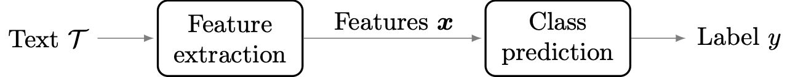

# Short Text Classification with Machine Learning in the Social Sciences: The Case of Climate Change on Twitter
This repository contains the codes and data necessary to reproduce the results of the following article:

K. Shyrokykh, M. Girnyk and L. Dellmuth, "Short Text Classification with Machine Learning in the Social Sciences: The Case of Climate Change on Twitter," submitted.

## Abstract
To analyse large numbers of texts, social science researchers are increasingly confronting the challenge of text classification. 
When manual labeling is not possible and researchers have to find automatized ways to classify texts, computer science provides a useful toolbox 
of machine-learning methods whose performance remains understudied in the social sciences. In this article, we compare the performance of the most 
widely used text classifiers by applying them to a typical research scenario in social science research: a relatively small labeled dataset with 
infrequent occurrence of categories of interest, which is a part of a large unlabeled dataset. As an example case, we look at Twitter communication 
regarding climate change, a topic of increasing scholarly interest in interdisciplinary social science research. Using a novel dataset including 
5,750 tweets from various international organizations regarding the highly ambiguous concept of climate change, we evaluate the performance of 
methods in automatically classifying tweets based on whether they are about climate change or not. In this context, we highlight two main findings. 
First, supervised machine-learning methods perform better than state-of-the-art lexicons, in particular as class balance increases. Second, traditional 
machine-learning methods, such as logistic regression and random forest, perform similarly to sophisticated deep-learning methods, whilst requiring much 
less training time and computational resources. The results have important implications for the analysis of short texts in social science research.

## Problem formulation
The general text classification problem can be formally described as follows. Given a text 
 
find a label 
 
from a set of available 
classes 
 
that best associates with 
. 
Because we do not know the true label 
, 
we can only make the best guess 

which, hopefully, matches 
. 
The corresponding workflow is depicted in Fig. 1 below.

 *Fig.1. Text classification workflow.

In general, a text can refer to a whole document, or to a section, paragraph, or sentence within a document. Here, we are analysing 
Twitter data and so we work with tweets. On the Twitter microblogging platform, tweets are the name given to short texts that may contain one or 
several sentences of anything up to 280 characters. N.b., Twitter used to have a limit of 140 characters per tweet in English language until 2012, 
when the limit was increased to 280 characters due to commonly observed cramming. 

Generally speaking, tweet texts are considered to be unstructured data. This might be acceptable for a human analyst, who would recognize the context and the meaning 
in each text and would usually have little or no difficulty with labeling them. However, the unstructured nature of tweets is problematic for 
an automated text classifier. This requires the conversion of a text into a structured numerical representation. For instance, a lexicon-based classifier 
needs to tokenize  the text, or to break it up into separate words. After the text is tokenized, the classifier can then match the words within it 
with the key terms from the lexicon. More advanced machine-learning based classifiers need to map the text into a feature space and create a numerical 
representation of it, 
, 
which is referred to as a feature vector, consisting of measurable properties of the observed phenomenon, acting as an input  to the classifier.

## Repository structure
The pository consists of the following folders:
- **data** - datasets with various degrees of imbalance used to produce the article results
- **models** - trained models for various degrees of imbalance used to produce the article results
- **notebooks** - collection of Jupyter notebooks with code reproducing the article results
  * **testing** - notebooks with codes for testing the classifiers performance
  * **training** - notebooks with codes for training the classifiers
  * **tuning** - notebooks with codes for tuning the classifier parameters to optimize their performance
- **results** - figures and tables from the article
- **utils** - utility Python scripts

N.b., the seed for Tensorflow implementations was not fixed beforehand, hence re-running the neural-network classifiers might yield results diffent from those reported in the article.

## Dataset
The full dataset is available at [https://zenodo.org/record/7633599#.Y-lbTS8w1qs](https://zenodo.org/record/7633599\#.Y-lbTS8w1qs).

N.b., As Twitter data cannot be published directly, the dataset is converted into the <em>dehydrated</em> form (i.e., only publishing tweet IDs, 
not text or other meta-data). Therefore, to use the data, one needs to first <em>hydrate</em> them (i.e., download the specific tweets by their IDs 
using, e.g., the [Hydrator app](https://github.com/DocNow/hydrator/releases). 

## Preprint
A preprint of the article will be available at https://arxiv.org/pdf/xxxx.yyyyy.pdf.

## Computation environment
In order to run the code in this repository the following software packages are needed:
* `Python 3` (for reference we use Python 3.8.10), with TensorFlow and SciKit-learn implementations of the considered algorithms.
* `Jupyter` (for reference we use version 7.22.0).

## License
This code is licensed under the Apache-2.0 license. If you are using this code in any way for research that results in a publication, please cite the article above.
